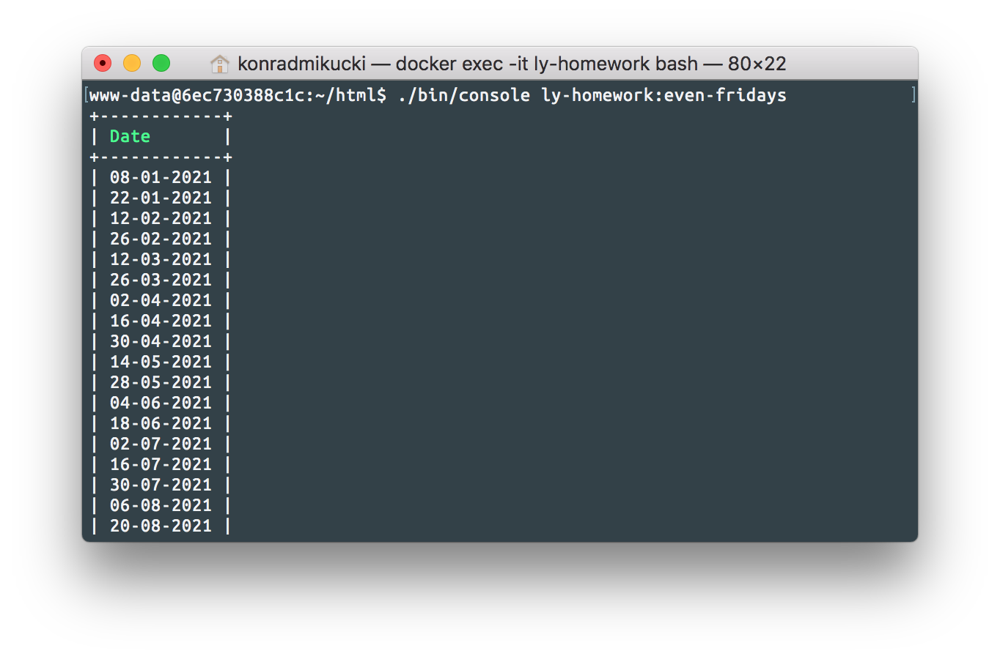

[](https://coveralls.io/github/komik966/ly-homework?branch=master)
[](https://travis-ci.org/komik966/ly-homework)

Run with Docker
===============
1. Build image:
```bash
docker build . -t ly-homework
```

2. Run container:
```bash
# If you want mounted project:
docker run -p 4000:80 --name ly-homework --mount type=bind,source="$(pwd)",destination=/var/www/html ly-homework
# If you don't:
docker run -p 4000:80 --name ly-homework ly-homework
```

3. Start nginx:
```bash
docker exec -u root ly-homework /etc/init.d/nginx start
```

Task 1: Even fridays
====================
Execute it as Symfony command:



With Docker:
```bash
docker exec ly-homework ./bin/console ly-homework:even-fridays
```